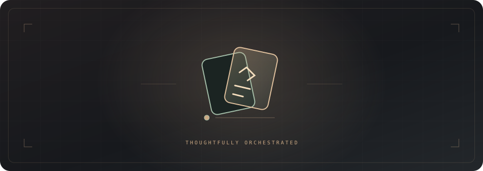

<div align="center">



# Atelier

### 한 작업을, 역할에 맞는 모델에게.

Codex가 설계와 최종 책임을 유지하면서 OpenAI·Claude 모델을 비용과 위험에 맞게 배치하는 소프트웨어 작업실입니다.

[Quick start](#quick-start) · [Routes](#routes) · [Configuration](#configuration) · [Safety](#safety)

</div>

## Why Atelier

모든 코드를 가장 비싼 모델이 작성할 필요는 없습니다. Atelier는 요구를 이해하고 판단하는
역할, 실제 변경을 만드는 역할, 결과를 검증하는 역할을 분리합니다. 작은 수정은 현재
Codex가 직접 끝내고, 구현량이 크거나 독립 검토가 필요한 경우에만 다른 모델을 호출합니다.

```text
request → architect → implementer → parent verification → reviewer → ship | fix-first | rethink
```

현재 Codex 작업은 항상 오케스트레이터이자 최종 인수자입니다. 구현자의 보고만으로
수락하지 않고 실제 diff와 검증 결과를 다시 확인합니다.

## Quick start

옵션 없이 시작하거나, 구현 모델 하나만 지정해도 됩니다. 다섯 역할은 책임 구분이며
다섯 모델을 매번 호출한다는 뜻은 아닙니다. 검증은 보통 현재 Codex가 도구로 수행하고,
수정 반영은 리뷰에서 문제가 발견될 때만 진행합니다.

```text
$atelier 로그인 오류를 수정하고 검증해줘.
$atelier --implementer luna/medium 이 명세대로 구현해줘.
$atelier --dry-run --planner parent --implementer claude:haiku --reviewer sol/high
$atelier --help
```

`--dry-run`은 모델 호출·인증 확인·파일 변경 없이 설정만 보여줍니다. 설계 결과가 필요하면
`--phase plan`을 사용하세요. `--planner`는 `--architect`의 별칭입니다.

현재 모델이 Astra라면 다음처럼 역할을 조합할 수 있습니다.

```text
# 작고 명확한 변경: Astra가 직접 처리
$atelier --mode solo 이 기능을 구현하고 테스트해줘.

# 기본 추천: Astra가 설계·검토, Sol이 구현
$atelier --mode delegate --architect parent --implementer sol/medium --reviewer parent 이 기능을 구현해줘.

# 구현 난도가 높음: Astra가 설계·검토, Terra가 구현
$atelier --mode delegate --architect parent --implementer terra/high --reviewer parent 이 리팩터링을 완료해줘.
```

`parent`는 현재 Codex 작업의 모델과 추론 강도를 그대로 사용합니다. 명시된 모델은
실행 전에 해당 런타임에서 실제로 사용할 수 있는지 확인합니다.

## Routes

| Route | Use it for | Example |
| --- | --- | --- |
| `solo` | 작은 수정, 설명, 잘 정의된 작업 | `--mode solo` |
| `delegate` | 구현량이 크고 명세가 충분한 작업 | `--implementer sol/medium` |
| `cross` | 독립적인 다른 공급자 검토가 필요한 변경 | `--implementer claude:sonnet/medium --reviewer codex:sol/high` |

Atelier는 기본 `auto` 모드에서 위임 비용과 위험을 비교합니다. `cross`는 Codex와 Claude를
모두 사용하며, 독립 검토를 포함합니다. 작은 작업에 교차 공급자 호출을 강제하지 않습니다.

### Roles

| Role | Default | Responsibility |
| --- | --- | --- |
| `architect` | `parent` | 요구 해석, 설계, 작업 명세 |
| `implementer` | `auto` | 코드와 테스트 변경 |
| `verifier` | `parent` | 실제 diff와 검증 결과 분석 |
| `reviewer` | `auto` | `ship`, `fix-first`, `rethink` 판정 |
| `repairer` | `implementer` | 지적을 반영한 수정 |

역할은 각각 지정할 수 있습니다.

```text
$atelier --architect parent --implementer sol/medium --verifier parent --reviewer parent 작업 설명
$atelier --architect codex:terra/high --implementer claude:sonnet/medium --reviewer codex:sol/high 작업 설명
```

`--phase plan`은 설계까지만 수행하고, `--phase review`는 파일을 수정하지 않고 검토만
수행합니다. `--max-calls`, `--max-repairs`, `--timeout`으로 비용과 반복 횟수를 제한할 수
있습니다. 모든 옵션은 [실행 계약](./SKILL.md)에 정리되어 있습니다.

## Configuration

<details>
<summary>프로젝트별 기본 모델과 실행 한도 설정</summary>

프로젝트 루트에 `.atelier.json`을 두면 기본 조합을 반복해서 쓰지 않아도 됩니다.

```json
{
  "mode": "delegate",
  "architect": "parent",
  "implementer": "sol/medium",
  "verifier": "parent",
  "reviewer": "parent",
  "max_calls": 4,
  "max_repairs": 1,
  "timeout": 600
}
```

현재 요청의 옵션이 설정 파일보다 우선합니다. 설정은 다음 명령으로 모델 호출 없이 검증할
수 있습니다.

```bash
python3 atelier/scripts/resolve-route.py --workdir /absolute/path/to/project
```

자세한 모델 해석과 비용 판단은 [routing.md](./references/routing.md)를 확인하세요.

</details>

## Claude lane

Claude 역할을 선택하면 로컬 Claude Code CLI와 Python 3가 필요합니다.

Codex 앱의 현재 모델을 Anthropic 모델로 바꾸는 방식이 아닙니다. Codex가 로컬 Claude
Code 프로세스에 명세를 전달하고 결과와 변경 파일을 회수합니다. OpenAI 역할은 사용 가능한
네이티브 하위 에이전트를 이용합니다. 모델 이름을 지정해도 구독의 사용 권한이 추가되지는
않으며, 사용량과 제한은 실제 호출에 사용된 각 도구의 계정·인증 설정에 따릅니다.

```bash
atelier/scripts/claude-lane.sh --check
```

설계와 리뷰는 읽기·검색 도구만 사용합니다. 구현 역할만 파일을 수정할 수 있으며, 실제
JSON 결과·모델 증거·타임아웃을 확인한 뒤 결과를 게시합니다. 요청 모델이 실제 실행 모델과
다르면 해당 lane은 실패 처리됩니다.

## Safety

- 같은 파일을 수정하는 구현자는 동시에 실행하지 않습니다.
- 구현 결과는 현재 Codex가 실제 diff와 테스트로 재검증합니다.
- 모델·인증·타임아웃 실패를 다른 모델로 조용히 대체하지 않습니다.
- 수정은 기본적으로 원 구현자에게 돌아가며, 반복 실패는 `rethink`로 전환합니다.
- 구현 또는 리뷰만으로 커밋·배포·외부 메시지 전송 권한이 생기지 않습니다.

## Development

<details>
<summary>로컬 구조 검사와 모델 호출 없는 회귀 테스트</summary>

```bash
python3 ~/.codex/skills/.system/skill-creator/scripts/quick_validate.py atelier
python3 atelier/scripts/test-resolve-route.py
atelier/scripts/test-claude-lane.sh
```

브리지는 가짜 Claude CLI로 인증, 권한, 모델 불일치, 잘못된 JSON, 타임아웃, 결과 보존을
검증합니다. 이 테스트는 실제 모델 호출을 만들지 않습니다.

</details>
