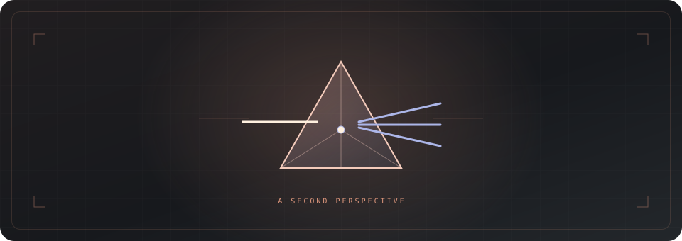

<div align="center">



**구현은 Codex에서. 다른 시선은 Claude에게.**

읽기 전용 코드 리뷰 · Opus 5.5 · 추가 Python 패키지 없음

[시작하기](#시작하기) · [사용법](#사용법) · [실행 상세](docs/runtime.md) · [레퍼런스](https://github.com/openai/codex-plugin-cc)

</div>

---

Prism은 Codex에서 Claude에게 독립적인 코드 검토를 요청하는 플러그인입니다.
구현 오류부터 설계의 가정과 실패 경로까지, 근거 있는 지적을 파일 위치와 함께 돌려줍니다.
결과를 받은 뒤 무엇을 반영할지는 사용자가 결정합니다.

## 다른 시선, 같은 작업 공간

| | |
| :--- | :--- |
| **일반 리뷰** | 정확성, 회귀, 빠진 테스트 관점으로 변경 검토 |
| **적대적 리뷰** | 설계 선택, 숨은 가정, 현실적인 실패 경로 검토 |
| **Opus 5.5** | 모델 고정. Codex가 작업에 맞춰 high / xhigh 선택 |
| **읽기 전용** | 수정·자동 반영·반복 리뷰 없이 결과 전달에서 종료 |

로컬 Claude Code CLI를 직접 사용합니다. 별도 서버나 API 연동 코드를 설치할 필요가 없습니다.
추론 강도 선택에도 별도의 LLM 호출을 추가하지 않습니다.

## 시작하기

**macOS / Linux · Python 3.10+ · Git · 로그인된 Claude Code**가 필요합니다.
Claude CLI는 `--safe-mode`, `--restricted`, `--json-schema`를 지원해야 합니다.

저장소 루트에서 스킬을 연결합니다. 기존 `prism` 경로가 있다면 먼저 확인하세요.

```bash
mkdir -p ~/.codex/skills
ln -s "$PWD/prism/skills/prism" ~/.codex/skills/prism
```

새 Codex 작업에서 **Prism · Claude 코드 리뷰**를 선택하거나 `$prism`으로 호출합니다.
플러그인 배포용 매니페스트도 포함되어 있습니다. 위 명령은 개인 스킬 연결 방식입니다.

## 사용법

```text
$prism 현재 변경을 검토해줘.

$prism main 대비 변경을 적대적으로 검토해줘.
재시도와 중복 처리에 집중해줘.

$prism xhigh로 권한 경계와 동시성 문제를 검토해줘.
```

기본 범위는 staged·unstaged 변경과 untracked 파일입니다.
브랜치 비교는 깨끗한 작업 트리에서 수행합니다. 리뷰 후에는 필요할 때
“타당한 지적만 확인해서 반영해줘”라고 Codex에 별도로 요청하세요.

<details>
<summary>CLI로 직접 실행하기</summary>

```bash
python3 prism/skills/prism/scripts/review.py --check
python3 prism/skills/prism/scripts/review.py --cwd /path/to/repo --mode adversarial
python3 prism/skills/prism/scripts/review.py --cwd /path/to/repo --base main --effort xhigh
```

`--path`로 범위를 좁히고, `--dry-run`으로 입력을 확인하고,
`--output /absolute/report.json`으로 결과를 저장할 수 있습니다.

</details>

## 작은 실행, 명확한 경계

- 읽기 도구만 제공하고 세션 대화 저장을 끕니다. 검토 코드와 문맥은 Claude 제공자에게 전송되며 계정 사용량을 소비합니다.
- 입력은 240KB, 실행은 기본 10분으로 제한합니다. 입력을 몰래 자르거나 실패를 자동 재시도하지 않습니다.
- 검토 도중 대상 변경이 감지되면 결과에 경고를 붙입니다.
- 타임아웃·종료 신호에 자식 프로세스를 정리합니다. 부모만 강제 종료하는 경우의 한계는 [실행 상세](docs/runtime.md)에 설명합니다.

핵심 로컬 테스트는 다음 명령으로 실행합니다.

```bash
python3 -m unittest discover -s prism/tests -v
```

## Credits

[OpenAI의 Codex plugin for Claude Code](https://github.com/openai/codex-plugin-cc)에서 영감을 받아,
Codex가 Claude의 검토를 받는 방향으로 직접 구현했습니다.
Prism은 OpenAI 또는 Anthropic의 공식 제품이 아닙니다.
Claude와 Codex 명칭은 각 소유자의 상표이며, 배너의 픽셀 캐릭터와 프리즘은 이 프로젝트를 위해 제작한 독자적인 그래픽입니다.
