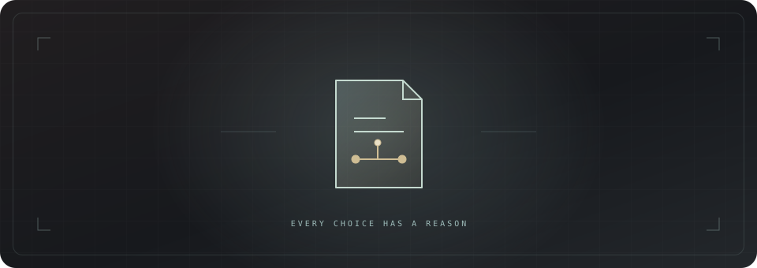

<div align="center">



# Rationale

### 선택에는 근거를. 결정에는 기록을.

기술의 비용·설계·운영 영향을 비교하고, 필요한 경우 ADR로 남기는 Codex 플러그인입니다.

결정 지원 · ADR 작성 · ADR 검토 · 별도 모델 호출 없음

[사용법](#사용법) · [진행 방식](#요청에-따른-진행) · [템플릿](#개인용-템플릿) · [설치](#설치와-호출)

</div>

## 사용법


| 스킬 | 용도 |
| --- | --- |
| `rationale` · 기술 결정 | 분석·심층 조사·선택형 질문으로 결정 지원. 요청한 경우 작성까지 연결 |
| `rationale-write` · ADR 작성 | 이미 정리된 선택·근거를 기록. 전체 조사나 인터뷰를 반복하지 않음 |
| `rationale-review` · ADR 검토 | 기존 ADR의 근거·공정한 비교·재검토 조건 확인 |

```text
$rationale 알림 구현 방식을 비교해줘. 2주 안에 만들고 싶고 배포 환경은 이미 정해져 있어.
$rationale-write 이미 선택한 방식을 docs/decisions에 기록해줘. 실제로 비교한 내용은 다음과 같아…
$rationale-review docs/decisions/0001-notification.md의 근거와 재검토 조건을 확인해줘.
```

위 이름은 스킬 메타데이터의 호출 예시입니다. 플러그인 설치 후 실제 노출 이름과 네임스페이스는 호스트의 스킬 선택기에서 확인합니다. 앱 슬래시 명령을 등록하는 패키지는 아닙니다. 자연어로도 해당 목적을 요청할 수 있습니다.

## 요청에 따른 진행

| 요청 | 진행과 종료 |
| --- | --- |
| A와 B를 깊게 비교해서 결정만 도와줘 | 프로젝트·근거·영향 분석 후 선택 지원. ADR 미생성 |
| A 쪽으로 기울었는데 비용과 설계 영향을 검토해줘 | 좁혀진 후보 중심으로 반론·연쇄 영향 확인 |
| 비교해서 바로 ADR까지 작성해줘 | 분석부터 작성까지 진행. 아직 채택하지 않은 추천은 Proposed |
| 이미 A로 정했어. ADR로 남겨줘 | 제공된 결정과 근거를 재사용해 바로 기록 |
| 이 ADR을 검토해줘 | 기존 문서 검토. 수정 요청 없이는 파일 미변경 |

먼저 에이전트가 비용·설계·운영·전환 부담과 연쇄 영향을 조사합니다. 필수 변경, 특정 조건에서 필요한 변경, 선택적 개선을 구분합니다. 결과는 결정용 요약을 먼저, 상세 근거를 뒤에 제공합니다. 단순 요청이나 이미 완료된 선택에는 전면 조사를 반복하지 않습니다.

추가 질문은 호스트가 제공하는 선택형 UI를 우선 사용하며 직접 입력과 필요한 경우 `아직 모름`을 허용합니다. 답변과 무관한 조사는 계속하고, 사용자 답이 필요한 판단은 기다립니다. 기본 선택·시간 경과를 답변으로 취급하지 않습니다. 질문 도구가 없는 환경에서는 번호 선택과 직접 입력으로 대체합니다.

## 개인용 템플릿

[템플릿](skills/rationale/assets/adr-template.md)은 MADR 구조에 날짜·상태 상단 표와 `Reconsideration Conditions`를 결합했습니다. 작성자·공유 대상 속성은 없습니다. 작성 안내는 한국어이며 완성 ADR에서는 제거합니다. 기존 프로젝트 양식을 지정하면 그것을 우선합니다.

[완성 예시](examples/0001-notification-polling.md)는 가상의 개인 프로젝트 요청으로 실제 스킬을 실행해 만든 기록입니다. 실제 성능 실험이나 사용자 프로젝트의 결정 기록은 아닙니다.

날짜는 결정·제안 날짜입니다. 과거 결정일을 모르면 사후 기록일과 구분합니다. `Accepted`는 채택을 의미하며 구현·성능 검증 완료를 의미하지 않습니다. 새 제안이 생긴 것만으로 기존 결정을 `Superseded`로 바꾸지 않습니다.

일반적인 결정은 ADR 한 파일로 끝내고 긴 조사 기록이 필요할 때만 별도 노트를 연결합니다. 선택이 이미 끝났다면 인터뷰를 반복하지 않습니다. 검토 요청만으로 기존 파일을 수정하지 않습니다.

## 설치와 호출

별도 서버·API 키·추가 모델 없이 호스트의 대화·검색·파일 도구를 사용합니다.
저장소 루트에서 세 스킬을 연결하세요. 같은 이름의 파일이나 링크가 있으면 덮어쓰지 말고 먼저 확인합니다.

```bash
mkdir -p ~/.codex/skills
ln -s "$PWD/rationale/skills/rationale" ~/.codex/skills/rationale
ln -s "$PWD/rationale/skills/rationale-write" ~/.codex/skills/rationale-write
ln -s "$PWD/rationale/skills/rationale-review" ~/.codex/skills/rationale-review
```

새 작업의 스킬 선택기에서 세 이름을 확인합니다. 이 명령은 개인 스킬 연결 방식이며,
플러그인 설치로 전환할 때는 기존 링크와 중복 설치하지 않습니다.

## 검증

<details>
<summary>세 스킬과 플러그인의 로컬 구조 검사</summary>

Codex의 기본 제작 스킬이 설치된 환경에서 저장소 루트 기준으로 실행합니다.

```bash
python3 ~/.codex/skills/.system/skill-creator/scripts/quick_validate.py rationale/skills/rationale
python3 ~/.codex/skills/.system/skill-creator/scripts/quick_validate.py rationale/skills/rationale-write
python3 ~/.codex/skills/.system/skill-creator/scripts/quick_validate.py rationale/skills/rationale-review
python3 ~/.codex/skills/.system/plugin-creator/scripts/validate_plugin.py rationale
```

구조 검사와 판단 품질은 다릅니다. [행동 평가 사례](tests/behavioral.md)와 [이번 검증 기록](tests/validation.md)을 함께 확인합니다. [템플릿 출처·변경 사항](TEMPLATE-NOTES.md)도 포함합니다.

</details>
